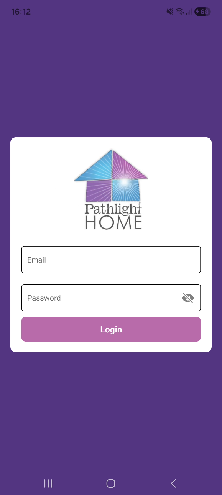
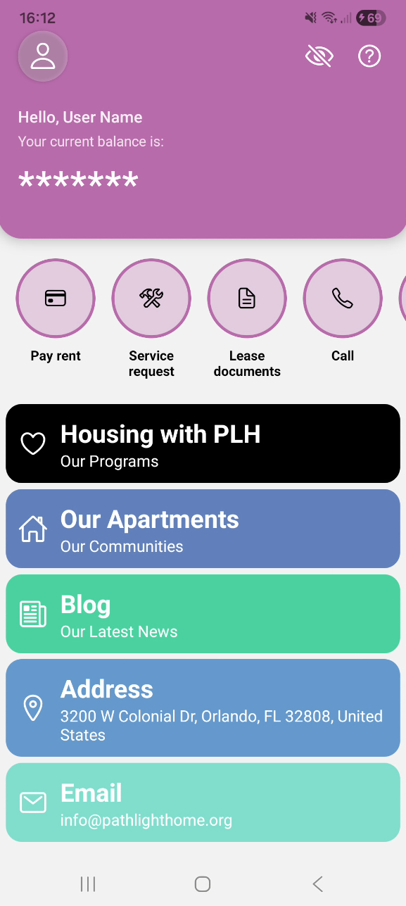
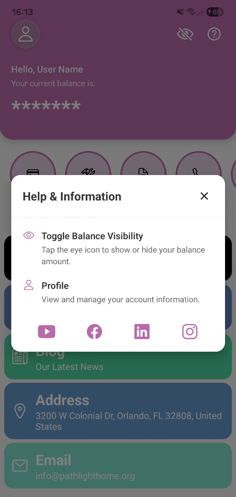

# PathLight MVP

A modern React Native mobile application built with Expo Router, featuring user authentication, balance management, and biometric security.

## About

This is a Minimum Viable Product (MVP) mobile application for [Pathlight HOME](https://www.pathlighthome.org/), a nonprofit organization dedicated to changing the lives of homeless and low-income individuals by providing affordable housing and economic opportunities. Since 1992, Pathlight HOME has helped house over 8,000 people in the Orlando, Florida area.

## Screenshots

### Login Screen


The login screen features:
- Email and password authentication
- Biometric login option (fingerprint/face ID)
- Form validation with user-friendly error messages

### Home Screen


The home dashboard displays:
- User profile header with balance information
- Quick access options for housing, apartments, and blog
- Contact information and support resources

### Help Modal


The help modal provides:
- Feature explanations and tips
- Social media links to connect with Pathlight HOME

## Features

- **User Authentication** - Secure login system with form validation using Zod
- **Biometric Authentication** - Support for fingerprint/face ID login
- **Balance Dashboard** - View and toggle visibility of account balance
- **Profile Management** - User profile with customizable settings
- **Help & Support** - In-app help modal with social media links
- **Modern UI** - Clean, responsive design with smooth animations

## Prerequisites

Before you begin, ensure you have installed:

- [Node.js](https://nodejs.org/) (v18 or later)
- [npm](https://www.npmjs.com/) or [yarn](https://yarnpkg.com/)
- [Expo CLI](https://docs.expo.dev/get-started/installation/)

## Installation

1. **Clone the repository**
   ```bash
   git clone <repository-url>
   cd PathLightMVP
   ```

2. **Install dependencies**
   ```bash
   npm install
   ```

3. **Start the development server**
   ```bash
   npx start
   ```

## Project Structure

```
PathLightMVP/
├── app/                      # App screens and navigation
│   ├── _layout.tsx          # Root layout
│   ├── index.tsx            # Login screen
│   └── home/                # Home screens
├── components/              # Reusable components
│   ├── CustomInput/         # Custom input component
│   ├── LoginForm/           # Login form component
│   └── home/                # Home screen components
│       ├── Informative/     # Info cards
│       ├── Option/          # Option buttons
│       └── ProfileHeader/   # Profile header with modal
├── hooks/                   # Custom React hooks
│   └── useLoginForm.ts      # Login form logic
├── schemas/                 # Data schemas and DTOs
│   ├── dto/                 # Data transfer objects
│   └── zod/                 # Zod validation schemas
├── services/                # API and service layer
│   ├── auth.service.ts      # Authentication service
│   └── biometric.service.ts # Biometric authentication
└── styles/                  # Styling files
    └── components/          # Component-specific styles
```

## Tech Stack

- **Framework**: [React Native](https://reactnative.dev/) (v0.81.5)
- **Navigation**: [Expo Router](https://docs.expo.dev/router/introduction/) (v6.0.21)
- **UI Components**: Custom components with React Native
- **Icons**: [@expo/vector-icons](https://icons.expo.fyi/)
- **Validation**: [Zod](https://zod.dev/) (v4.2.1)
- **Biometric Auth**: [expo-local-authentication](https://docs.expo.dev/versions/latest/sdk/local-authentication/)
- **TypeScript**: Type-safe development

## Key Components

### LoginForm
Handles user authentication with email and password validation.

### ProfileHeader
Displays user profile information and balance with toggle visibility.

### HelpModal
Provides contextual help and social media links.

### CustomInput
Reusable input component with validation and styling.

## Security Features

- Zod schema validation for form inputs
- Biometric authentication support
- Secure credential storage
- Input sanitization